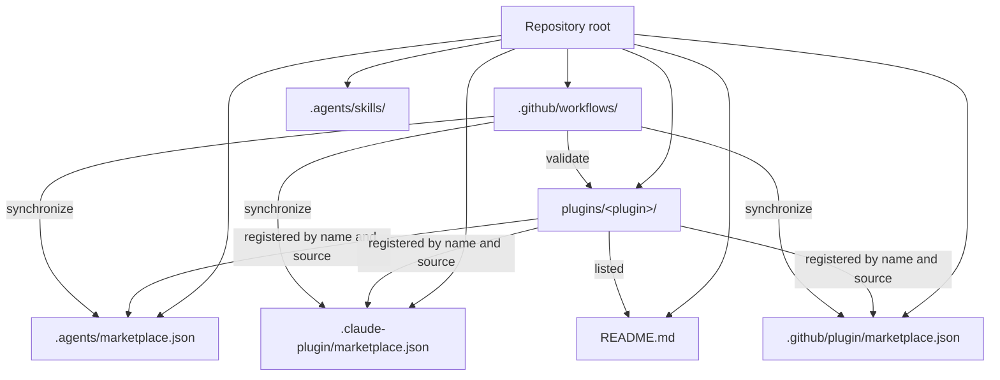
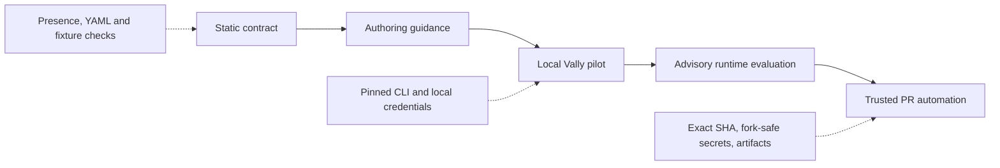
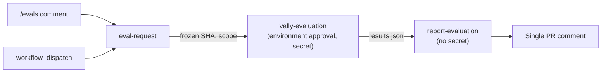

# Architecture

## Purpose

This repository distributes Microcks-related AI-agent plugins through compatible marketplace manifests. It also holds the contributor guidance, validation workflows, and repository-level agent skills required to maintain those plugins consistently.

`AGENTS.md` is the operational entry point for contributors and agents. This document explains why the repository is structured as it is and records the intended evaluation architecture.

## Marketplace topology



### Installable plugins

Every directory under `plugins/` is an independent installable plugin. A plugin contains its manifest, documentation, distributable skills or agents, and a license link:

```text
plugins/<plugin-name>/
├── plugin.json
├── README.md
├── LICENSE -> ../../LICENSE
├── skills/
│   └── <skill-name>/
│       └── SKILL.md
├── agents/                 # optional
├── hooks/                  # optional
└── instructions/           # optional
```

`LICENSE` is a symbolic link to the root Apache 2.0 license. This provides a single source of truth and avoids license copies diverging over time.

The root [README.md](./README.md) is the public plugin catalogue and installation guide. A plugin must be listed there before it can be considered complete.

### Marketplace manifests

The same plugin registrations are published for three agent environments:

| Manifest | Consumer |
|----------|----------|
| `.agents/marketplace.json` | Codex / OpenAI Agents |
| `.claude-plugin/marketplace.json` | Claude Code |
| `.github/plugin/marketplace.json` | GitHub Copilot |

The manifests intentionally duplicate the plugin list rather than linking one file from the others. Each consumer expects its manifest at a fixed location. The `marketplace-sync` workflow treats the three plugin lists as one logical record and rejects drift.

### Repository-local agent skills

The `.agents/skills/` directory is separate from `plugins/`. It contains skills that improve the repository's own coding agents; they are not marketplace plugins and are not installed by end users.

Third-party repository skills are installed and updated with APM. The `apm.yml` manifest declares sources and `apm.lock.yaml` pins their resolved revisions. Both files are committed so that agent capabilities are reproducible for every contributor.

Repository-authored developer skills belong in the same directory but are not APM dependencies. The `plugin-authoring` skill is one such local skill: it is the public coordinator for creating plugins, skills, agents, and their evaluation specifications. It composes the APM-managed `skill-creator` workflow with internal plugin-contract and plugin-delivery-report skills. The separately invocable `plugin-test` skill creates and reviews external evaluation scenarios and fixtures. This keeps authoring guidance, distribution rules, test design, and reporting independently maintainable. None of these local skills may appear in a marketplace manifest.

## Validation architecture

[validation.yml](.github/workflows/validation.yml) is the single repository-validation workflow. Its static job runs the plugin structure, marketplace synchronization, README registration, skill and agent profiles, external evaluation quality, dashboard generation, and runner self-checks in one execution. The contract validator accumulates independent failures, so a developer receives every actionable static error from one run instead of fixing failures one workflow at a time.

The static job is deterministic, credential-free, and runs for every relevant pull request and push to `main`, including contributions from forks. The Vally job is in the same workflow but only runs when a maintainer requests it, either with a `/evals` pull-request comment or a manual dispatch.

### Progressive contract adoption

The structured validator distinguishes objective errors from heuristics. Objective errors include malformed manifests, missing registrations or documentation, invalid frontmatter, unsafe or missing references, missing evals, invalid fixtures, and evaluations too small to produce a credible verdict. Heuristics such as token range, section count, workflow steps, and example density are warnings.

Pull requests pass a base commit to the validator. An objective finding attached to a new or changed component is blocking; the same finding on untouched legacy content is reported as grandfathered debt. This makes the policy monotonic without a permanent allowlist: no new debt can enter, and touching an existing component brings that component under the current contract.

The validator writes `artifacts/validation/report.json` with `schemaVersion: 1`. The report is both an Actions artifact and the source for the dashboard catalogue. It contains distributable metadata and aggregate quality facts, not model conversations.

## Evaluation architecture

### Direction

The target evaluation model follows the structural principles of the Vally approach used by `dotnet/skills`, but is introduced incrementally. The repository-local `plugin-test` skill helps contributors create evaluation specifications outside the distributable plugin package:

```text
tests/<plugin-name>/<skill-name>/eval.yaml
```

Keeping evaluations under `tests/` has two benefits:

1. Marketplace installations include only the plugin content needed at runtime.
2. Test fixtures, prompts, graders, and experimental results evolve without changing the installed artifact boundary.

The `plugin-authoring` and `plugin-test` skills are repository developer tools, not marketplace plugins. Their own specifications are stored under `tests/repository-skills/plugin-authoring/eval.yaml` and `tests/repository-skills/plugin-test/eval.yaml`; they are deliberately outside the plugin evaluation namespace.

### Phased adoption



| Phase | Scope | Merge policy |
|-------|-------|--------------|
| Static contract | Require a valid external evaluation specification and validate it without a model. | Required |
| Authoring guidance | Define scenario, fixture, grader, and non-hijacking conventions. | Required with the static contract |
| Local pilot | Run the pinned Vally CLI with [eng/run-skill-evals.sh](./eng/run-skill-evals.sh) and preserve raw artifacts for inspection. | Advisory |
| Maintainer runtime evaluation | A maintainer comments `/evals [plugin] [skill]` on a pull request, or dispatches [validation.yml](.github/workflows/validation.yml) for one reviewed commit. It compares a baseline with the target skill, uploads raw artifacts, and posts aggregate verdicts on the pull request. | Advisory until stable |
| Trusted PR automation | Run model-backed evaluations only from a maintainer-approved, SHA-bound request with scoped credentials. | Future decision |

### Evaluation specifications

An `eval.yaml` describes observable user scenarios. A scenario contains a prompt and one or more graders. Prefer deterministic graders such as output or file checks when possible; use model judging only for semantic properties that cannot be checked deterministically.

Model-backed comparison should distinguish:

- **Baseline**: no skill loaded.
- **Skilled**: only the target skill loaded.
- **Plugin**: the complete plugin loaded, when plugin-level interaction matters.

The comparison is meaningful only when there is adequate evidence:

$$
\text{trials} = \text{number of stimuli} \times \text{runs per stimulus}
$$

The `dotnet/skills` reference treats fewer than five trials as underpowered. Five is only a floor: diverse scenarios and additional runs are needed to reduce ties and model variance.

An evaluation file must not declare both `config:` and `defaults:`. Use `defaults:` for current authoring and keep the run count local to the specification rather than overriding every test globally.

### Security boundary for model execution

Model-backed evaluation is not a normal pull-request command. It requires credentials and may execute contributor-controlled prompts and fixtures. The eventual runtime workflow must therefore:

- keep structural linting separate from credentialed execution;
- never expose model credentials to untrusted fork code;
- require a trusted maintainer trigger;
- bind execution to an explicit reviewed commit SHA rather than a moving branch head;
- validate derived plugin, skill, and fixture paths before using them;
- retain raw artifacts so timeouts and harness failures are not misreported as skill regressions.

Static validation remains the required quality gate. The runtime job receives its Copilot credential only from the `COPILOT_GITHUB_TOKEN` secret in the approval-protected `vally-evaluation` environment. The local runner provides the same skill-free baseline versus isolated-skill comparison model as `dotnet/skills`; it adapts each completed run into a Vally `compare` verdict at `eval-results/<plugin>/<skill>/results.json`. The verdict uses the direction of paired wins and losses with an exact one-sided sign test, reporting insufficient or incomplete evidence as inconclusive. Generated output remains ignored and is not a pull-request requirement.

### Pull-request evaluation flow



1. `eval-request` runs without the model credential. It accepts only comments from users with write or admin permission, parses the scope with [eval-request.mjs](./eng/vally-adapter/eval-request.mjs), freezes the pull request head SHA at comment time, and posts a queued comment showing that SHA to the environment approver.
2. `vally-evaluation` checks out the runner, adapter, and experiment from the workflow's own revision (the default branch for comments) and replaces only `plugins/` and `tests/` with the frozen commit. A pull request therefore cannot modify the code that receives the credential.
3. `report-evaluation` holds `pull-requests: write` but no model credential. It renders the adapted verdicts with [pr-comment.mjs](./eng/vally-adapter/pr-comment.mjs) and updates one comment identified by the `<!-- vally-evals -->` marker. Only aggregate metrics are rendered; prompts, evidence, and trajectories remain in the run's artifacts.

## Public dashboard architecture

> [!NOTE]
> Publication is currently disabled. The dashboard is still built as a static check, but `publish-evaluation-data` and `deploy-dashboard` run only when the `DASHBOARD_PUBLISHING` repository variable is `true`. Until then, evaluation results are visible only in pull-request comments and workflow summaries.

The dashboard combines two trust domains:

1. The current plugin catalogue and static quality profile, deterministically regenerated from `main`.
2. Aggregate Vally verdict history, written only after a maintainer-approved evaluation of a commit that is already an ancestor of `main`.

The `dashboard-data` branch stores a versioned `history.json`, deduplicated by run and skill and bounded to the latest five records per skill. Published records contain the evaluated commit, workflow URL, model labels, verdict state, net win, sign-test counts and p-value, and trial count. Raw prompts, model outputs, evidence strings, and trajectories remain in short-lived private workflow artifacts and are never copied into public history.

GitHub Pages is deployed through the official Pages actions with a read-only checkout and narrowly scoped `pages: write` and `id-token: write` permissions. The dashboard is a static application with no runtime service or model credential. The repository must enable Pages with **GitHub Actions** as its source. Maintainers should protect `dashboard-data` so only the publication workflow can update it.

## Contributor navigation

- For day-to-day plugin creation and updates, follow [AGENTS.md](./AGENTS.md).
- For local skill usage and end-to-end contributor paths, follow [Developer workflows](./docs/developer-workflows.md).
- For the public plugin list and installation instructions, use [README.md](./README.md).
- For repository contribution practices, use [CONTRIBUTING.md](./CONTRIBUTING.md).