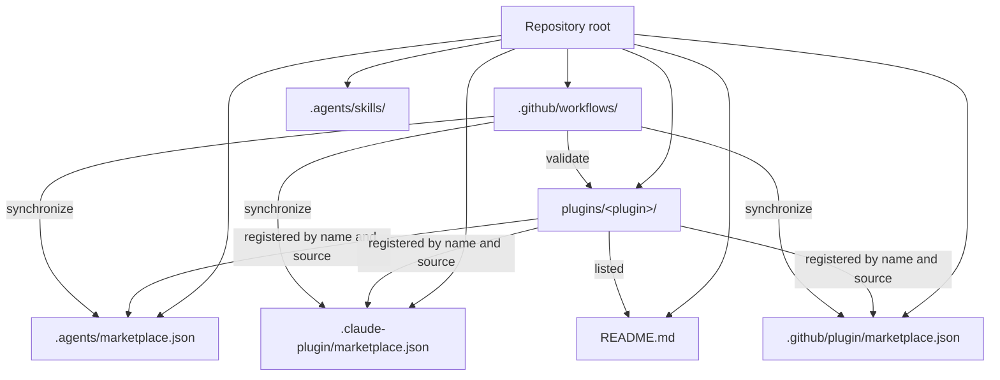
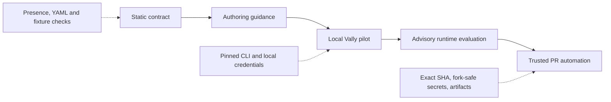

# Architecture

## Purpose

This repository distributes Microcks-related AI-agent plugins through compatible marketplace manifests. It also holds the contributor guidance, validation workflows, and repository-level agent skills required to maintain those plugins consistently.

`AGENTS.md` is the operational entry point for contributors and agents. This document explains why the repository is structured as it is and records the intended evaluation architecture.

## Marketplace topology



### Installable plugins

Every directory under `plugins/` is an independent installable plugin. A plugin contains its manifest, documentation, distributable skills or agents, and a license link:

```text
plugins/<plugin-name>/
├── plugin.json
├── README.md
├── LICENSE -> ../../LICENSE
├── skills/
│   └── <skill-name>/
│       └── SKILL.md
├── agents/                 # optional
├── hooks/                  # optional
└── instructions/           # optional
```

`LICENSE` is a symbolic link to the root Apache 2.0 license. This provides a single source of truth and avoids license copies diverging over time.

The root [README.md](./README.md) is the public plugin catalogue and installation guide. A plugin must be listed there before it can be considered complete.

### Marketplace manifests

The same plugin registrations are published for three agent environments:

| Manifest | Consumer |
|----------|----------|
| `.agents/marketplace.json` | Codex / OpenAI Agents |
| `.claude-plugin/marketplace.json` | Claude Code |
| `.github/plugin/marketplace.json` | GitHub Copilot |

The manifests intentionally duplicate the plugin list rather than linking one file from the others. Each consumer expects its manifest at a fixed location. The `marketplace-sync` workflow treats the three plugin lists as one logical record and rejects drift.

### Repository-local agent skills

The `.agents/skills/` directory is separate from `plugins/`. It contains skills that improve the repository's own coding agents; they are not marketplace plugins and are not installed by end users.

Third-party repository skills are installed and updated with APM. The `apm.yml` manifest declares sources and `apm.lock.yaml` pins their resolved revisions. Both files are committed so that agent capabilities are reproducible for every contributor.

Repository-authored developer skills belong in the same directory but are not APM dependencies. The `plugin-authoring` skill is one such local skill: it is the public coordinator for creating plugins, skills, agents, and their evaluation specifications. It composes the APM-managed `skill-creator` workflow with internal plugin-contract and plugin-delivery-report skills. The separately invocable `plugin-test` skill creates and reviews external evaluation scenarios and fixtures. This keeps authoring guidance, distribution rules, test design, and reporting independently maintainable. None of these local skills may appear in a marketplace manifest.

## Validation architecture

The repository uses small, independent workflows rather than a single broad workflow. Each workflow has one ownership boundary and a clear failure message.

| Workflow | Responsibility |
|----------|----------------|
| [plugin-structure.yml](.github/workflows/plugin-structure.yml) | Validates required plugin files and verifies that each skill directory has `SKILL.md`. |
| [marketplace-sync.yml](.github/workflows/marketplace-sync.yml) | Verifies that every plugin is registered and that all marketplace plugin lists are identical. |
| [readme-plugins.yml](.github/workflows/readme-plugins.yml) | Verifies that every plugin directory is mentioned in the root README. |

These checks are intentionally deterministic. They run without model credentials and are suitable for every pull request, including contributions from forks.

## Evaluation architecture

### Direction

The target evaluation model follows the structural principles of the Vally approach used by `dotnet/skills`, but is introduced incrementally. The repository-local `plugin-test` skill helps contributors create evaluation specifications outside the distributable plugin package:

```text
tests/<plugin-name>/<skill-name>/eval.yaml
```

Keeping evaluations under `tests/` has two benefits:

1. Marketplace installations include only the plugin content needed at runtime.
2. Test fixtures, prompts, graders, and experimental results evolve without changing the installed artifact boundary.

The `plugin-authoring` and `plugin-test` skills are repository developer tools, not marketplace plugins. Their own specifications are stored under `tests/repository-skills/plugin-authoring/eval.yaml` and `tests/repository-skills/plugin-test/eval.yaml`; they are deliberately outside the plugin evaluation namespace.

### Phased adoption



| Phase | Scope | Merge policy |
|-------|-------|--------------|
| Static contract | Require a valid external evaluation specification and validate it without a model. | Required |
| Authoring guidance | Define scenario, fixture, grader, and non-hijacking conventions. | Required with the static contract |
| Local pilot | Run a pinned Vally CLI manually and preserve raw artifacts for inspection. | Advisory |
| Runtime evaluation | Compare a baseline with a target skill and optionally the complete plugin. | Advisory until stable |
| Trusted PR automation | Run model-backed evaluations only from a maintainer-approved, SHA-bound request with scoped credentials. | Future decision |

### Evaluation specifications

An `eval.yaml` describes observable user scenarios. A scenario contains a prompt and one or more graders. Prefer deterministic graders such as output or file checks when possible; use model judging only for semantic properties that cannot be checked deterministically.

Model-backed comparison should distinguish:

- **Baseline**: no skill loaded.
- **Skilled**: only the target skill loaded.
- **Plugin**: the complete plugin loaded, when plugin-level interaction matters.

The comparison is meaningful only when there is adequate evidence:

$$
\text{trials} = \text{number of stimuli} \times \text{runs per stimulus}
$$

The `dotnet/skills` reference treats fewer than five trials as underpowered. Five is only a floor: diverse scenarios and additional runs are needed to reduce ties and model variance.

An evaluation file must not declare both `config:` and `defaults:`. Use `defaults:` for current authoring and keep the run count local to the specification rather than overriding every test globally.

### Security boundary for model execution

Model-backed evaluation is not a normal pull-request command. It requires credentials and may execute contributor-controlled prompts and fixtures. The eventual runtime workflow must therefore:

- keep structural linting separate from credentialed execution;
- never expose model credentials to untrusted fork code;
- require a trusted maintainer trigger;
- bind execution to an explicit reviewed commit SHA rather than a moving branch head;
- validate derived plugin, skill, and fixture paths before using them;
- retain raw artifacts so timeouts and harness failures are not misreported as skill regressions.

Until that workflow exists, static validation remains the required quality gate and model execution remains an explicit local or maintainer-controlled pilot.

## Contributor navigation

- For day-to-day plugin creation and updates, follow [AGENTS.md](./AGENTS.md).
- For local skill usage and end-to-end contributor paths, follow [Developer workflows](./docs/developer-workflows.md).
- For the public plugin list and installation instructions, use [README.md](./README.md).
- For repository contribution practices, use [CONTRIBUTING.md](./CONTRIBUTING.md).