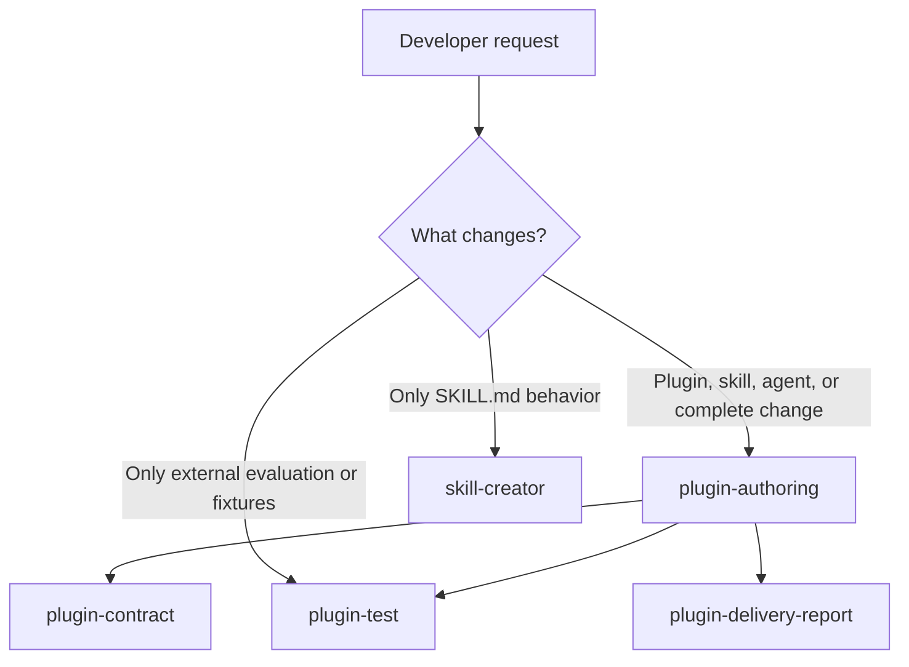

# Developer workflows

This guide explains how repository contributors use the local authoring skills to create and maintain installable plugins. These skills help maintain the repository; they are not distributed to people who install Microcks plugins.

## What the local skills solve

A plugin change usually affects more than one file. For example, adding a skill can require its content, plugin metadata, marketplace registrations, public documentation, external evaluation scenarios, and validation. The local skills make those dependencies explicit so contributors do not accidentally publish an incomplete plugin or package test material with runtime content.

| Local skill | Use it for | Result |
|-------------|------------|--------|
| `plugin-authoring` | A complete plugin, skill, agent, or evaluation change | Identifies the smallest affected boundary and coordinates the required work |
| `skill-creator` | Writing or improving a `SKILL.md` | A trigger-oriented skill with an observable outcome and focused workflow |
| `plugin-test` | Creating or reviewing `eval.yaml` scenarios and fixtures | External, outcome-focused evidence that avoids prompt and rubric overfitting |
| `plugin-contract` | Used internally by `plugin-authoring` | Correct plugin structure, registration, documentation, license, and versioning |
| `plugin-delivery-report` | Used internally by `plugin-authoring` | A factual completion report with scope, evidence, validation, and runtime status |

`plugin-contract` and `plugin-delivery-report` are implementation details of the main workflow. Contributors normally start with `plugin-authoring` or `plugin-test`.

## Choose the right entry point



Use `plugin-authoring` when unsure. It reads the existing repository artifacts, determines whether a new plugin is justified, and applies the other relevant workflows.

## Before starting

1. Read [AGENTS.md](../AGENTS.md) for the operational rules.
2. Read [ARCHITECTURE.md](../ARCHITECTURE.md) when changing plugin structure, marketplace manifests, validation, or evaluation practices.
3. Inspect the nearest existing plugin, its `plugin.json`, README, skills or agents, and any matching test directory.
4. Describe the user-visible outcome before creating files. This avoids creating a plugin simply because a new file is needed.

## Create or evolve a plugin

Ask `plugin-authoring` for a complete change, for example:

```text
/plugin-authoring Add a contract-review skill to the existing microcks plugin.
It should help contributors validate an OpenAPI contract before publishing it.
```

The workflow determines the smallest change and applies these rules:

1. **Use an existing plugin when it is the correct functional boundary.** A new plugin is for independently installable behavior, not a convenience folder.
2. **Create a complete plugin only when needed.** A new plugin needs `plugin.json`, `README.md`, at least one skill or agent, and a `LICENSE` symbolic link to the repository root license.
3. **Keep registrations synchronized.** New plugins are registered identically in all three marketplace manifests and listed in the root README.
4. **Version published content deliberately.** Follow Semantic Versioning when changing a published plugin.
5. **Keep developer tooling local.** Nothing under `.agents/skills/` belongs in a marketplace manifest or the public plugin table.

## Write or improve a skill

Use `skill-creator` when the work is specifically the contents of a `SKILL.md`. It focuses on the capability itself: when the skill should activate, which outcome it enables, and the workflow needed to get there.

A distributable skill is stored at:

```text
plugins/<plugin-name>/skills/<skill-name>/SKILL.md
```

A good skill:

- has frontmatter whose `name` matches its folder;
- has a description that states both its behavior and when it should activate;
- guides the agent toward a specific artifact, decision, change, or report;
- keeps large reference material in `references/` rather than making the entry file difficult to load;
- does not restate generic advice with no observable result.


After the behavior is ready, use `plugin-authoring` to check the plugin-specific distribution work that accompanies it.

## Create external evaluation evidence

Use `plugin-test` for a directly invocable skill or agent. It creates test specifications outside the installable package:

```text
# Skill
tests/<plugin-name>/<skill-name>/eval.yaml

# Agent
tests/<plugin-name>/agent.<agent-name>/eval.yaml
```

Fixtures live beside the specification, normally under `fixtures/`. They must be tracked and referenced by the test definition. Keeping this material outside `plugins/` prevents test prompts and fixtures from becoming part of marketplace installations.

A distributed skill may omit a direct eval only when its frontmatter declares `disable-model-invocation: true`. Such a reference skill cannot be selected from a natural user prompt; its behavior belongs in the evaluation of the invocable skill or agent that loads it. The validation report identifies this distinction explicitly.

### Design scenarios from user outcomes

Write prompts as natural developer requests. Do not name the target skill or agent, tell the model to use a skill, or copy wording from the target instructions. Cover the relevant scenarios:

- **Positive:** the user needs the intended behavior.
- **Boundary:** a plausible but wrong outcome is rejected.
- **Non-activation:** the request resembles the target but is outside its stated boundary. Use `expect_activation: false` when supported.

Non-activation scenarios should verify three independent outcomes:

1. The request was recognized as out of scope.
2. The target workflow was not applied.
3. The user received a useful alternative next step.

### Prefer broad, outcome-focused evidence

Use deterministic output or file checks for facts that can be measured. Use patterns that allow legitimate wording differences. Reserve semantic rubrics for quality properties that cannot be tested mechanically.

A rubric should describe the result, not the method used to obtain it:

| Outcome-focused | Overfitted |
|-----------------|------------|
| Identified the missing dependency as the build failure's cause. | Ran a specific diagnostic command with an exact flag. |
| Proposed a concrete corrective change. | Used a named step from the skill instructions. |

An evaluation file uses `defaults:` for shared run settings and must not declare both `defaults:` and `config:`. A future comparative conclusion needs enough evidence:

$$
\text{trials} = \text{number of stimuli} \times \text{runs per stimulus}
$$

Use at least five trials before making a comparison verdict. Pull-request checks remain deterministic and credential-free. Contributors can run the local Vally pilot with [eng/run-skill-evals.sh](../eng/run-skill-evals.sh); it requires local Copilot authentication and keeps generated output under the Git-ignored `eval-results/` directory.

### Run a local comparison

The runner compares a skill-free baseline with a run that loads only the target skill. It then uses Vally's position-swapped `compare` command to write a per-skill `results.json` verdict. Start with a dry run, then execute the narrowed evaluation:

```sh
./eng/run-skill-evals.sh plugin1 skill1 --dry-run
./eng/run-skill-evals.sh plugin1 skill1
```

#### Run only the workflow being changed

Developers should start with the smallest scope: one plugin and one skill. This is the fastest execution, avoids spending model calls on unrelated evaluations, and produces a result only for the changed skill.

```sh
# Replace <plugin> and <skill> with the directories under plugins/<plugin>/skills/.
./eng/run-skill-evals.sh <plugin> <skill> --dry-run
./eng/run-skill-evals.sh <plugin> <skill>
```

The runner resolves the matching external specification at `tests/<plugin>/<skill>/eval.yaml`; it stops if either that file or the skill entry point is missing. Run `./eng/run-skill-evals.sh <plugin>` only when changes affect several skills in the same plugin. Run `./eng/run-skill-evals.sh` only for repository-wide evaluation work.

A comparison with insufficient or incomplete evidence is reported as inconclusive rather than as a regression. See [eng/README.md](../eng/README.md) for prerequisites, configuration overrides, and output locations.

### Select a Claude model locally

The tracked [microcks-agent-skills.experiment.yaml](../microcks-agent-skills.experiment.yaml) deliberately uses the `copilot-sdk` executor. This is the repository default and must remain unchanged so contributors and CI use the same Copilot runtime.

The executor and model are different settings. The current default already asks Copilot to run `claude-sonnet-5`. To try another Claude model available through the developer's Copilot entitlement, copy the experiment file outside the repository, update only `overrides.model`, then point the runner to that copy:

```sh
cp microcks-agent-skills.experiment.yaml "$TMPDIR/microcks-agent-skills.claude.yaml"
# Edit overrides.model in the copied file to a Claude model available to you.
EXPERIMENT_FILE="$TMPDIR/microcks-agent-skills.claude.yaml" \
    ./eng/run-skill-evals.sh plugin1 skill1
```

Do not commit a local model selection or change `executor: copilot-sdk`. Vally 0.12.0 provides `copilot-sdk` as its built-in agent executor; selecting a Claude model changes the model served by Copilot, not the agent runtime to Claude Code.

## Run validation in GitHub Actions

[validation.yml](../.github/workflows/validation.yml) is the repository's single validation workflow. Its static job runs automatically for relevant pull requests and pushes, and completes all deterministic checks before returning a failure. This groups independent contract errors in one run.

The Vally job never runs automatically because it uses a protected Copilot credential. Configure the `vally-evaluation` GitHub environment with required maintainer reviewers and the `COPILOT_GITHUB_TOKEN` secret.

### Evaluate a pull request with `/evals`

A maintainer with write access comments on the pull request:

```text
/evals                    # every covered skill
/evals <plugin>           # one plugin
/evals <plugin> <skill>   # one skill
```

The workflow reacts with 👀, freezes the pull request head commit at the time of the comment, and posts a single evaluation comment marked as queued. A reviewer of the `vally-evaluation` environment then approves the run for that commit. When it finishes, the same comment is updated with one row per skill: verdict, wins/ties/losses, sign-test p-value, trial count, and net win. Prompts and trajectories are never posted in the pull request; they stay in the run's artifacts.

The runner, adapter, and experiment come from the default branch. Only `plugins/` and `tests/` come from the evaluated commit, so a pull request cannot change the code that receives the credential. Comments from users without write access, invalid arguments, closed pull requests, and missing `tests/<plugin>[/<skill>]` directories receive a short reply and start no evaluation. The trigger takes effect only once the workflow is on the default branch, because GitHub always runs `issue_comment` workflows from there.

### Evaluate a commit manually

A maintainer can also run **Actions → validation → Run workflow**, supply the reviewed 40-character commit SHA, and optionally narrow the run to one plugin and skill. The results appear in the job summary. For the current checkout, the equivalent GitHub CLI invocation is:

```sh
gh workflow run validation.yml --ref main \
    -f ref="$(git rev-parse HEAD)" \
    -f plugin=<plugin> \
    -f skill=<skill>
```

Omit `plugin` and `skill` only when a reviewed repository-wide comparison is intended. The action uploads `eval-results/` as an artifact even when the runtime evaluation fails, so incomplete trajectories can be inspected.

### Dashboard publication

The dashboard code in [eng/dashboard/](../eng/dashboard/) is still built by the static job as a check, but it is not published. The `publish-evaluation-data` and `deploy-dashboard` jobs run only when the `DASHBOARD_PUBLISHING` repository variable is set to `true`.

## Validate before requesting review

Install the pinned dependency once, then run the diff-aware gate and optionally preview the dashboard:

```sh
npm ci --prefix eng/validation
bash eng/validate.sh --base-ref HEAD --report artifacts/validation/report.json
node eng/dashboard/build.mjs --report artifacts/validation/report.json --output artifacts/dashboard
```

With `--base-ref`, unchanged legacy findings remain visible without blocking the pull request. Editing the affected component opts it into the complete current contract; no permanent allowlist is used.

Before finishing a plugin change, verify the items relevant to its scope:

- required plugin files and declared paths exist;
- `LICENSE` is a symbolic link to `../../LICENSE`;
- all marketplace manifests contain the same plugin registrations;
- the root README lists every new plugin;
- plugin metadata and documentation agree;
- evaluation YAML parses, referenced fixtures exist, and scenarios have realistic prompts and graders;
- the repository workflows pass.

`plugin-authoring` finishes with a concise report of changed artifacts, behavior, evidence, validations, and runtime status. It must state skipped or failed checks instead of treating them as successful.

## Typical contributor paths

| Goal | Start with | Then |
|------|------------|------|
| Add a new independently installable plugin | `plugin-authoring` | Validate registrations, README, license, and external evidence |
| Add a skill to an existing plugin | `skill-creator` | Use `plugin-authoring`, then `plugin-test` if it is directly invocable |
| Add an agent to an existing plugin | `plugin-authoring` | Add an `agent.<agent-name>` evaluation when its behavior needs evidence |
| Add or improve only an evaluation | `plugin-test` | Validate the YAML, fixtures, boundaries, and outcome-focused rubric |
| Update the public plugin table | Edit the root README | Do not add unrelated plugin or evaluation artifacts |

## Further reading

- [AGENTS.md](../AGENTS.md): concise contributor rules.
- [ARCHITECTURE.md](../ARCHITECTURE.md): marketplace and evaluation design.
- [CONTRIBUTING.md](../CONTRIBUTING.md): contribution process.
